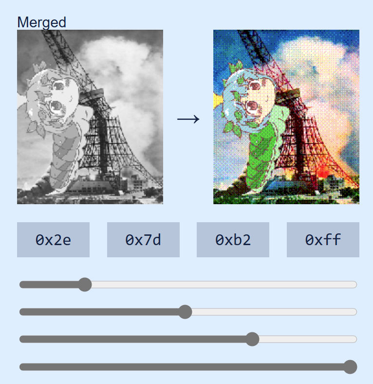

# Image dither GBfier

This is a modified version of [Herrzatacke's dither pattern generator](https://herrzatacke.github.io/dither-pattern-gen/)

This version allows converting any image to a color dithered game boy-sized image.

Try it at [maddoscientisto.github.io/dither-pattern-gen](https://maddoscientisto.github.io/color-dither-gbfier/)

##

To do:
- [ ] Support for trichroma in Pattern Group tab
- [ ] Independent dither pattern for each layer
- [ ] RGB channel Intensity sliders

## Original script
[github.com/HerrZatacke/dither-pattern-gen](https://github.com/HerrZatacke/dither-pattern-gen)

## Thanks
* [github.com/HerrZatacke](https://github.com/HerrZatacke) for making a great dither pattern generator that I could use as base
* The [GameBoy Camera Club Discord](https://discord.gg/C7WFJHG) for being a great place to develop the hobby of Game Boy camera photography
